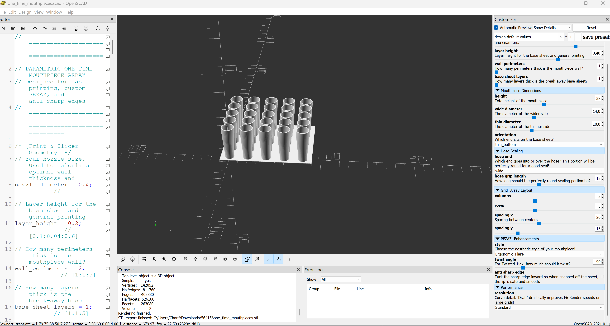

# Parametric 3D-Printable Hookah & Shisha Mouthpieces (OpenSCAD)

A highly parametric OpenSCAD script for generating custom, single-use **Hookah, Shisha, and Waterpipe disposable mouthpieces**. Originally designed to replace generic plastic tips with premium ergonomic equivalents, this script focuses on economical manufacturing, high hygiene, and 3D printing massive batches directly attached to a snap-off breakaway sheet. 

Whether you need a sleek whistle tip for your nargile, an ergonomic flare, or twisted geometric designs to impress guests at a lounge or party, this script dynamically math-matches its wall thickness to your 3D printer's nozzle size for super-fast, vase-mode style printing.

> **🚀 Quick Start:** Don't want to use OpenSCAD just yet? You can test print the pre-rendered **[5x5 Hookah Mouthpieces Array (`oneTimeMouthPieces 5x5.stl`)](./oneTimeMouthPieces%205x5.stl)** right now!

## 🌟 Key Features

1. **Automated Grid Layout:** Generates a parametrically spaced array (`N` x `M` columns and rows).
2. **Built-in Breakaway Sheet:** Automatically mounts all pieces onto a bottom layer (or several) with pre-cut air-holes, ensuring they stick to your print bed until snapped off smoothly. 
3. **Anti-Sharp Burr Removal:** A mathematical system that inverts sharp corners where the base connects to the sheet—meaning when users pluck them off, the fracture surface is tucked away and won't scratch their lips.
4. **Dynamic Transition Mesh:** Features a smooth S-curve lofting algorithm. One end connects perfectly round to a hose (guaranteed seal), while the other smoothly sweeps into an intricate mouthpiece shape!
5. **Print Math Automation:** You define the `nozzle_diameter` (e.g., 0.4mm) and `wall_perimeters` (e.g., 1 or 2), and the script internally calculates exactly how thick every feature should be so slicers trace them flawlessly without gap fills.

## 🎨 The "Pezaz" Styles

This script contains a dropdown library of intricate shapes for the end user's lips:

- **Classic:** Straight, smooth cone taper.
- **Twisted_Hex:** A spiraling hexagon that twists by a specified angle. Beautiful in Silk PLA!
- **Ribbed:** A beautiful 12-point wave outline that tapers perfectly at the ends.
- **Ergonomic_Flare:** Uses an ease-in-out mathematical spline to create a trumpet-like curve.
- **Whistle_Flat:** Keeps a perfect circle structure for the hose connection, then majestically swoops out into an oval rectangular flat shape for ergonomic puckering.

## 🛠️ How to Use

1. **Download OpenSCAD:** This tool runs on [OpenSCAD](https://openscad.org/downloads.html).
2. **Open the File:** Open `one_time_mouthpieces.scad`.
3. **Customize your Array:** Use the **Customizer Panel** (usually docked on the right side) to play with all the settings. 
   * Set your specific Nozzle Width.
   * Toggle the Grid Array sizes.
   * Pick your Style.
4. **Render:**
   * *(Tip: While playing with the grid, set `resolution` to 24 (Draft) for extremely fast visual updating)*
   * Press `F6` to render the final mesh (Change `resolution` to 36 or 72 before this step for buttery smooth geometry). 
5. **Export:** Press `F7` to export as `.STL` or `.3MF` and bring it into your slicer!

## 🖨️ Slicing & Economics Advice

When producing these economically:

1. Try printing **1 Perimeter thick** (`wall_perimeters = 1` in the script) and using standard vase-like contours. Ensure your seam alignment is continuous. 
2. Because 1kg of PLA produces thousands of these lightweight shells, fine-tuning your Retraction settings is crucial since grid-style printing demands traveling between pieces on every layer.
3. If selling in bulk, calculating the exact weight of a 5x5 array allows you to mathematically break down your exact material consumption per unit!

## 📜 License & Monetization

This project is released under the **Creative Commons Attribution-NonCommercial 4.0 International (CC BY-NC 4.0)** license.

- **✅ Personal Use (Free):** You are fully encouraged to download, play with, modify, and print these designs for yourself, your friends, and educational purposes!
- **❌ Commercial Use (Requires Licensing):** You may **NOT** use this script to mass-produce mouthpieces for sale, nor can you sell the generated 3D models or variations of this script, without a separate commercial agreement.

**Want to use this commercially?** 
If you are a business or individual looking to sell the generated mouthpieces (or the script itself), I'd love to work with you! to discuss purchasing a commercial license.
